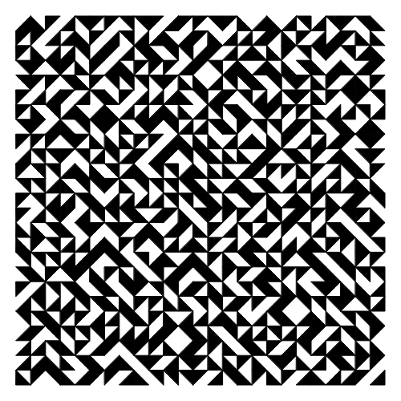
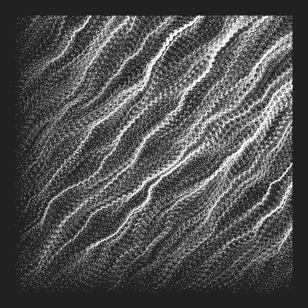

# About

## Intro to Creative Coding : Create Graphic Objects

-   A course by Julien Gachadoat, hosted at domestika.org

# Additional Resources

## U2

-   [Color Arrangement in Generative Art](https://tylerxhobbs.com/essays/2021/color-arrangement-in-generative-art)
-   [Computational Color](http://printingcode.runemadsen.com/lecture-color/)
-   [Random & Noise](http://www.generative-gestaltung.de/2/)
-   [Design as Art](https://stream.studieau.co/post/57582069103/design-is-fine-bruno-munari-faces-from-his)

## U3

-   [Four randomly distributed elements](https://www.centrepompidou.fr/fr/ressources/oeuvre/cez6op)
-   [Father Sébastien Truchet](https://jacques-andre.fr/faqtypo/truchet/index.html)
-   [About Me and My Machines](https://robertbalke.de/about/)
-   [AxiDraw + Processing](https://www.generativehut.com/post/axidraw-processing)

## U4

-   [Perlin Noise](https://genekogan.com/code/p5js-perlin-noise/)
-   [Fidenza](https://tylerxhobbs.com/fidenza)
-   [Flow Fields](https://tylerxhobbs.com/essays/2020/flow-fields)
-   [Discrete Flow](https://bendotk.com/#/discrete-flow/)
-   [Generating SVGs](https://observablehq.com/@makio135/generating-svgs/20)

## U5

-   [Generative Typography Experiments](https://www.syedrezaali.com/generative-typography-experiments/)

# Overview

<table border="2" cellspacing="0" cellpadding="6" rules="groups" frame="hsides">

<colgroup>
<col  class="org-left" />

<col  class="org-left" />

<col  class="org-left" />
</colgroup>
<thead>
<tr>
<th scope="col" class="org-left">Example Screenshots</th>
<th scope="col" class="org-left">( small selection )</th>
<th scope="col" class="org-left">&#xa0;</th>
</tr>
</thead>

<tbody>
<tr>
<td class="org-left"></td>
<td class="org-left"></td>
<td class="org-left"></td>
</tr>
</tbody>
</table>

